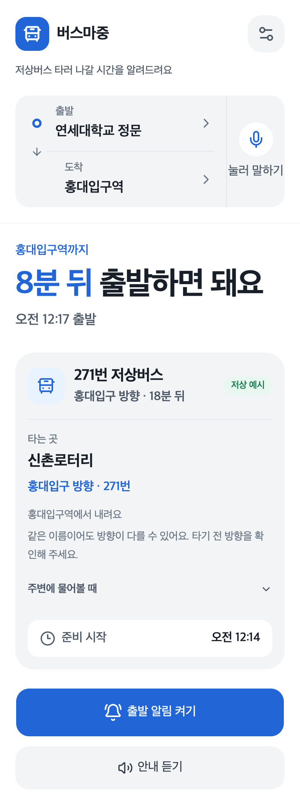
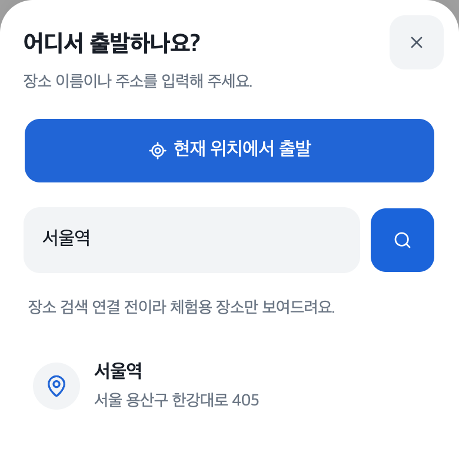
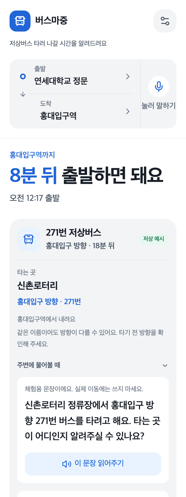
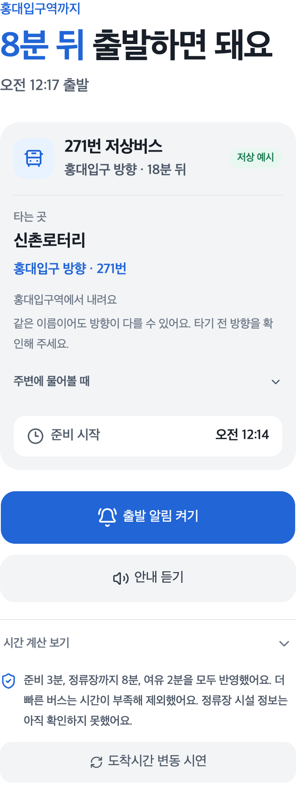
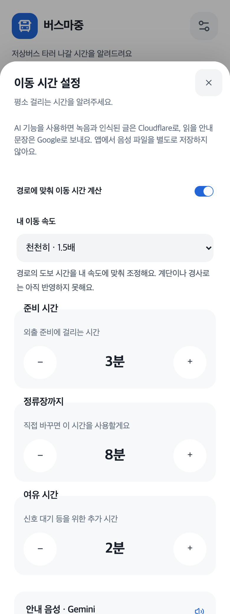

# 버스마중 (Low-Floor Bus AI)

<p align="center">
  
</p>

<p align="center">
  <b>저상버스 타러 나갈 시간을 알려드려요.</b><br/>
  출발지와 도착지를 말하면, 내 준비시간과 이동속도에 맞춰<br/>
  탈 수 있는 저상버스와 출발 시각을 안내하는 모바일 웹앱입니다.
</p>

<p align="center">2026 원티드 AI 해커톤을 위해 개발한 웹 프로토타입</p>

<p align="center">
  <a href="#preview">화면 미리보기</a> ·
  <a href="#feature">주요 기능</a> ·
  <a href="#getting-started">실행 방법</a> ·
  <a href="docs/ai-integration.md">AI 연결 가이드</a>
</p>

<br/>

## 🔖 Contents

- [🚌 Preview](#preview)
- [💙 Motivation](#motivation)
- [🛠️ Tech Stacks](#tech-stacks)
- [🎯 Feature](#feature)
- [🧩 Development](#development)
- [⚙️ Getting Started](#getting-started)
- [📌 Current Status](#current-status)
- [🗓️ Roadmap](#roadmap)

<br/>

<a id="preview"></a>

## 🚌 Preview

| **말이나 검색으로 이동 준비** | **내 속도에 맞춘 저상버스 추천** |
|:--:|:--:|
|  |  |

> 실제 앱을 Chrome의 모바일 크기(390 × 1040)에서 캡처했습니다. 경로·차량·도착시간은 내장 **체험 모드의 예시 데이터**이며, 실제 운행 정보가 아닙니다. 스크린샷은 AI 음성 품질을 입증하는 자료가 아닙니다.

<br/>

<a id="motivation"></a>

## 💙 Motivation

“저상버스가 온다는데, 나는 언제 나가야 할까?”

휠체어 사용자와 시각장애인 등 교통약자는 버스 도착시간과 함께
승차 위치·진행 방향·외출 준비시간·정류장까지의 이동시간을 확인해야 합니다.
화면을 읽거나 작은 버튼을 조작하기 어려우면 출발 전 정보를 찾는 일부터 부담이 됩니다.

버스마중은 이 과정을 **말로 경로 입력 → 저상버스 확인 → 준비·출발 시각 안내**로 연결합니다.
이용자가 정한 준비시간과 이동속도를 반영하고, 타는 정류장과 방향을 함께 안내합니다.

<br/>

<a id="tech-stacks"></a>

## 🛠️ Tech Stacks

### Frontend


### AI & Voice


| 역할 | 사용 기술 |
| --- | --- |
| 한국어 음성 → 텍스트 | Cloudflare Workers AI · Whisper large-v3-turbo |
| 출발지·도착지·시간 설정·질문 해석 | Cloudflare Workers AI · Qwen3-30B-A3B FP8 |
| 정류장·방향·출발 안내 읽기 | Gemini 2.5 Flash Preview TTS · Sulafat |
| 녹음·오디오 재생 | MediaRecorder · Web Audio API · PCM/WAV |

### Data & Runtime


- **카카오 API**: 장소·주소 검색, 직행 대중교통 경로 조회
- **TAGO API**: 주변 정류장, 노선·경유 정류장, 실시간 버스 도착정보
- **Next.js Route Handlers**: 서버에서 외부 API 호출 및 응답 검증
- **배포 대상**: Vercel · 설치 파일 없이 접속하는 웹 서비스

<br/>

<a id="feature"></a>

## 🎯 Feature

### 1. 출발지·도착지 입력

출발지와 도착지를 검색하거나 **현재 위치에서 출발**을 선택할 수 있습니다.
장소 이름이 같거나 일부만 일치하면 주소를 확인한 뒤 선택합니다.

**눌러 말하기**는 버튼을 누르고 있는 동안 최대 15초 녹음합니다.
한 번 눌러 시작·종료하는 방식으로 바꿀 수도 있고, **글로 입력**에서 문장을 직접 수정할 수도 있습니다.

<p align="center">
  
</p>

```text
연세대학교에서 홍대입구역까지, 준비는 5분
현재 위치에서 서울역까지
몇 분 뒤에 나가면 돼?
```

### 2. 저상버스만 추천

목적지까지 가는 직행 버스 경로를 찾고, 선택한 노선의 도착정보에서 **저상버스로 확인된 차량만** 앱에 전달합니다.
준비와 이동에 필요한 시간을 확보할 수 있는 차량을 추천합니다.

일반버스·비저상버스·차량유형 미확인 데이터는 제외합니다.
실시간 정보가 없으면 출발 시각을 확정하지 않고 다시 확인하도록 안내합니다.

### 3. 타는 정류장과 진행 방향

승차·하차 정류장과 버스 방향을 함께 안내합니다.
실제 데이터에서 확인된 경우 공개 정류장 번호, 다음 정류장, 승차 위치 지도 링크도 표시합니다.

**주변에 물어볼 때**를 펼치면 정류장과 방향이 포함된 질문을 큰 글씨로 보여줍니다.
Gemini 음성을 연결하면 해당 질문을 읽어줄 수 있습니다.

| **주변에 물어볼 문장** | **출발 시각의 계산 근거** |
|:--:|:--:|
|  |  |

### 4. 내 속도에 맞춘 준비·출발 시각

지도 경로의 도보 시간에 이동속도 배율을 적용하거나, 평소 정류장까지 걸리는 시간을 직접 입력합니다.
외출 준비와 신호 대기 등을 위한 여유 시간도 조절할 수 있습니다.

```text
필요 시간 = 준비 시간 + 정류장 이동 시간 + 여유 시간
출발 시각 = 버스 도착 시각 − 정류장 이동 시간 − 여유 시간
준비 시작 = 출발 시각 − 준비 시간
```

예를 들어 준비 3분, 이동 8분, 여유 2분이 필요하고 버스가 18분 뒤 도착한다면,
**5분 뒤 준비를 시작하고 8분 뒤 출발**하도록 안내합니다.

<p align="center">
  
</p>

### 5. 음성 안내와 알림

Gemini TTS로 경로와 정류장, 준비·출발 안내를 읽어줍니다.
음성 오류가 발생하면 화면에 알려주며, 다른 목소리로 자동 전환하지 않습니다.

출발 알림을 켜면 화면 안내와 지원 기기의 진동·브라우저 알림을 함께 사용합니다.
현재 알림은 **페이지가 실행 중일 때를 기준**으로 동작하며, 화면 잠금이나 앱 종료 후 예약 푸시는 아직 지원하지 않습니다.

<br/>

<a id="development"></a>

## 🧩 Development

### AI와 실제 데이터는 어떻게 연결하나요?

AI는 음성을 받아쓰고 이동 의도를 해석하며 안내 문장을 읽습니다.
장소·좌표는 지도 검색 결과로 확정하고, 차량 도착시간은 공공데이터에서 가져옵니다.
출발 시각은 확인된 ETA와 사용자 설정을 TypeScript 계산 코드로 대조해 정합니다.

오픈 모델을 새로 학습한 프로젝트는 아닙니다.
한국어 지시문, 구조화된 응답 스키마, 검증 코드와 외부 API를 연결했습니다.

### 반대편 정류장이나 같은 번호의 다른 노선은 어떻게 구분하나요?

지도 경로의 승하차 좌표와 TAGO 노선의 정류장 순서·방향을 비교합니다.
정류소 ID·도시코드·노선 ID가 확인된 경로만 실시간 도착정보에 연결합니다.
후보가 여러 개이거나 검증되지 않은 경우에는 출발 시각을 확정하지 않습니다.

### 조회할 때마다 출발 시각이 밀리지는 않나요?

최초 조회 시각과 초 단위 ETA를 절대 도착 시각으로 저장합니다.
시간 경과를 반영해 남은 시간을 계산하고, 오래된 데이터나 크게 변한 도착시간은 다시 확인합니다.
준비·출발 알림의 중복 실행과 뒤늦은 출발 음성 재생도 막습니다.

자세한 API 목록·권한·검증·개인정보 처리: [개발·운영 상세](docs/development.md)<br/>
모델 연결 규격과 테스트 절차: [AI 연결 가이드](docs/ai-integration.md)

<br/>

<a id="getting-started"></a>

## ⚙️ Getting Started

**Node.js 22.13 이상**이 필요합니다.

```bash
git clone https://github.com/HunKim-Dev/Low-Floor-Bus-AI.git
cd Low-Floor-Bus-AI
npm install
cp .env.example .env.local
npm run dev
```

[http://localhost:3000](http://localhost:3000)에서 확인합니다.
실제 조회·음성 기능에 사용할 서버 키는 [.env.example](.env.example)을 참고해 로컬에 등록합니다.
키 없이 실행하면 첫 화면의 **체험 경로로 둘러보기**에서 예시 추천 흐름을 확인할 수 있습니다.

실제 데이터에는 카카오 API와 TAGO **버스정류소정보·버스노선정보·버스도착정보** 활용 승인이 필요합니다.
음성 받아쓰기·문장 해석에는 Cloudflare Workers AI, 읽어주는 음성에는 Gemini API를 연결합니다.

### 검증

```bash
npm test
npm run build
```

104개 자동 테스트와 프로덕션 빌드가 통과한 상태입니다.
음성 인식·합성의 API 응답을 모의 처리하는 테스트와 실제 한국어 음질 평가는 구분합니다.
전체 린트에는 미사용 공용 UI 컴포넌트의 기존 오류가 남아 있으며, 변경 파일의 정적 검사는 통과했습니다.

### README 스크린샷 다시 찍기

```bash
npm run build
PLAYWRIGHT_MODULE=/absolute/path/to/playwright/index.mjs node scripts/capture-readme.mjs
```

Chrome과 Playwright가 필요합니다. 프로젝트에서 Playwright를 바로 불러올 수 있다면 환경변수는 생략할 수 있습니다.
캡처 스크립트는 별도의 로컬 서버에서 내장 체험 모드를 실행하고 외부 API 키를 비활성화합니다.
스크린샷은 [docs/screenshots](docs/screenshots)에 저장합니다.

```text
app/
  BusApp.tsx               모바일 UI와 이동 안내
  api/                     장소·경로·도착정보·음성 API
components/
  boarding-guide.tsx       탑승 정류장·방향 안내
lib/                       추천 계산·음성 처리·API 검증
docs/
  screenshots/             README 실제 화면 캡처
  ai-integration.md        AI 모델 연결 가이드
  development.md           개발·운영 상세
  hackathon-application.md 신청서 초안
scripts/
  capture-readme.mjs       체험 화면 캡처
tests/                     단위·API·브라우저 검사
```

<br/>

<a id="current-status"></a>

## 📌 Current Status

| 구현된 기능 | 현재 범위 |
| --- | --- |
| 경로 검색 | 환승 없는 단일 버스 경로, 최대 3개 후보 |
| 저상버스 추천 | 선택한 노선에서 실제 저상 차량으로 확인된 도착정보 |
| 음성 입력·해석 | Whisper + Qwen, 명확하지 않은 장소는 사용자 확인 |
| 안내 음성 | Gemini TTS 연동, 계정 할당량·네트워크에 따라 사용 제한 |
| 맞춤 시간 설정 | 준비·이동·여유 시간과 이동속도 배율 |
| PWA | 지원 브라우저에서 홈 화면에 추가 |

- **모든 후보 경로의 저상버스 ETA를 동시에 비교하는 자동 최적화는 아직 없습니다.**
- 휠체어 경사로·엘리베이터·보도 턱 등 실제 보행 접근성은 검증하지 않습니다.
- 데이터가 제공되지 않거나 지도·공공데이터가 일치하지 않는 구간은 실시간 추천이 제한됩니다.
- 서버 기반 예약 푸시와 앱 종료 상태의 알림은 미구현입니다.
- 실제 이용자 사용성 평가와 Android·iOS 실기기별 음성 품질 검증은 앞으로 진행할 과제입니다.

<br/>

<a id="roadmap"></a>

## 🗓️ Roadmap

- [x] 모바일 웹 UI · 출발지·도착지 검색 · 현재 위치 입력
- [x] Whisper 받아쓰기 · Qwen 의도 해석 · Gemini TTS 연동
- [x] 저상버스 필터링 · 정류장 방향 검증 · 개인별 출발 시각 계산
- [x] 준비·출발 알림 · 설정 저장 · 자동 테스트
- [ ] 배포 환경과 더 많은 지역·노선에서 실데이터 검증
- [ ] 여러 직행 경로의 저상버스 도착시간 동시 비교
- [ ] 휠체어 접근성 정보와 서버 기반 예약 푸시
- [ ] 실제 교통약자 사용성 평가

---

[GitHub](https://github.com/HunKim-Dev/Low-Floor-Bus-AI) · [AI 연결 가이드](docs/ai-integration.md) · [개발·운영 상세](docs/development.md)
